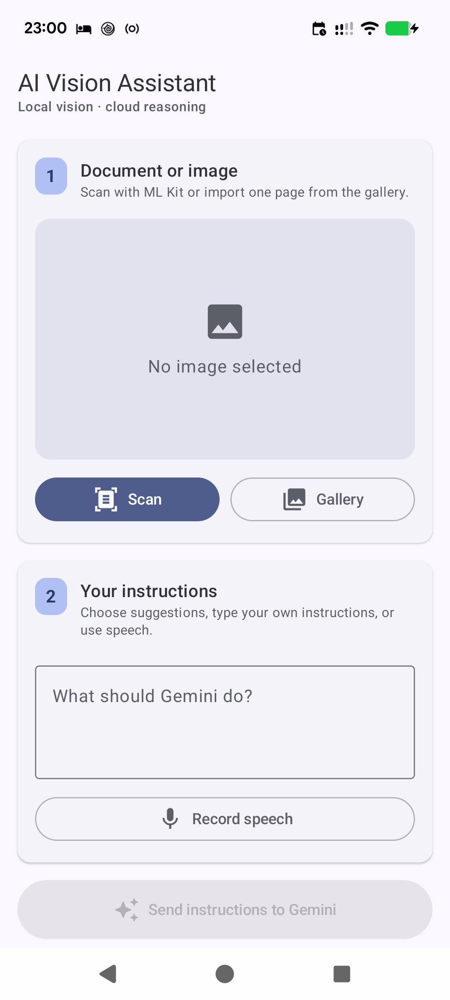
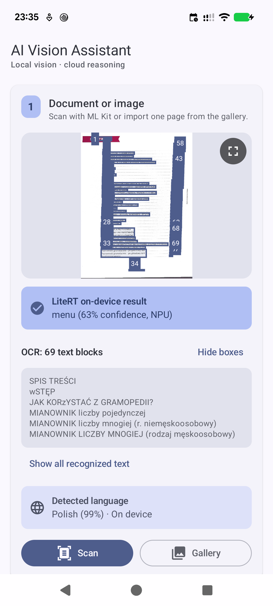
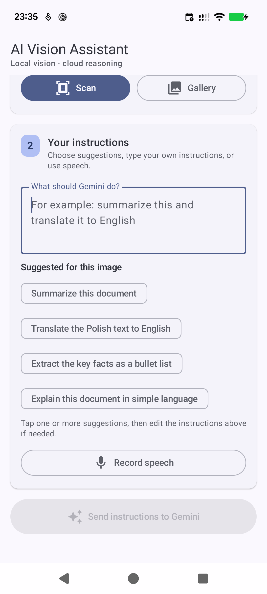
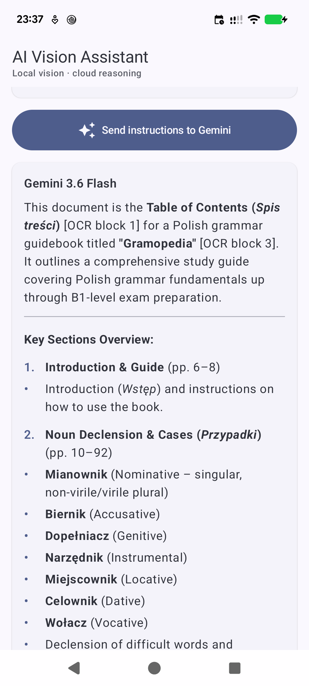

# AI Vision Assistant

## Application Description

AI Vision Assistant is a native Android multimodal assistant that scans or imports documents,
analyzes them on-device, and uses Gemini to answer typed or spoken requests.

## Screenshots

<table>
  <tr>
    <td align="center"></td>
    <td align="center"></td>
    <td align="center"></td>
    <td align="center"></td>
  </tr>
  <tr>
    <td align="center">Start</td>
    <td align="center">On-device analysis</td>
    <td align="center">Suggested actions</td>
    <td align="center">Gemini response</td>
  </tr>
</table>

## AI Features

| Feature | What it does | Library or technology                                        |
| --- | --- |--------------------------------------------------------------|
| Document scanning | Captures a clean, single-page document image. | Google ML Kit Document Scanner                               |
| Text recognition | Extracts selectable text and displays numbered OCR regions. | On-device ML Kit Text Recognition V2                         |
| Language identification | Detects the document language and suggests translation when useful. | On-device ML Kit Language Identification                     |
| Image classification | Classifies images locally with NPU, GPU, and CPU fallback. | On-device LiteRT with quantized MobileNet V2                 |
| Smart suggestions | Proposes actions for receipts, invoices, dates, contacts, tables, and translations. | Static suggestions based on results from on device ML models |
| Voice instructions | Converts spoken requests into editable instructions. | Android `SpeechRecognizer`                                   |
| Multimodal analysis | Analyzes the image, instructions, OCR text, and classification context. | Gemini 3.6 Flash through Firebase AI Logic                   |

## Architecture

The app uses Kotlin, Jetpack Compose, Material 3, MVVM, and clean domain/repository boundaries.
The `domain` layer contains models, repository contracts, and use cases; `data` contains ML Kit,
LiteRT, Firebase, scanner, and speech adapters; and `ui` contains the ViewModel and Compose screen.
Hilt provides dependency injection, while Kotlin Coroutines run local analysis concurrently.

## Pipeline

1. The user scans a document or imports an image with Android Photo Picker.
2. OCR and MobileNet V2 classification run concurrently on-device.
3. ML Kit identifies the language and the app creates relevant action suggestions.
4. The user enters, edits, or speaks an instruction.
5. The image and local analysis context are sent to Gemini through Firebase AI Logic.
6. The response is displayed as selectable Markdown.

## Setup and Run

1. Create a Firebase project, enable **Firebase AI Logic**, and select the Gemini Developer API.
2. Register `com.example.multimodalassistant` and place `google-services.json` in `app/`.
3. Configure Firebase App Check with a debug token for development or Play Integrity for release.
4. Open the project in Android Studio or build it with `./gradlew :app:assembleDebug`.
5. Run it on Android 8.0 or newer and grant camera and microphone permissions.
